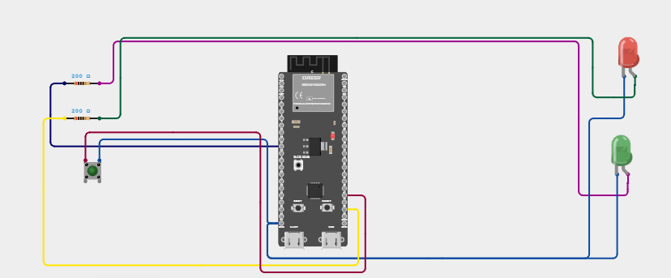

# Laboratory Activity 3: GPIO and Button Control

## Overview

This laboratory activity demonstrates the use of **GPIO (General Purpose Input/Output)** on an ESP32 microcontroller. A push button is used as a digital input to control two LEDs as digital outputs.

The button uses the ESP32's internal pull-up resistor through `INPUT_PULLUP`. When the button is pressed, the two LEDs change their states using an `if/else` condition.

## Features

- Uses ESP32 GPIO pins for digital input and output
- Uses the internal pull-up resistor on GPIO 23
- LED 1 turns **ON** when the button is released
- LED 2 turns **ON** when the button is pressed
- Uses an `if/else` statement for button control
- Demonstrates basic digital GPIO operation

## Components

- ESP32 development board
- Tactile push button
- 2 × LEDs
- 2 × 100Ω resistors
- Breadboard
- Jumper wires
- USB cable

## Wiring

### Push Button

- Button terminal 1 → ESP32 GPIO 23
- Button terminal 2 → GND

### LED 1

- Anode → GPIO 18 through a 100Ω resistor
- Cathode → GND

### LED 2

- Anode → GPIO 19 through a 100Ω resistor
- Cathode → GND

## Circuit Diagram

> **Disclaimer:** The following circuit diagram is a visual representation of the intended wiring and connections for the laboratory activity. It is not a photograph of the actual physical project setup.



## Project Setup

> **Disclaimer:** The following images show the actual physical project setup used for this laboratory activity. The arrangement and appearance of the components may vary slightly depending on the breadboard and wiring.


## Source Code

```cpp
#include <Arduino.h>

const uint8_t BUTTON_PIN = 23;
const uint8_t LED1_PIN = 18;
const uint8_t LED2_PIN = 19;

void setup() {
  pinMode(BUTTON_PIN, INPUT_PULLUP);
  pinMode(LED1_PIN, OUTPUT);
  pinMode(LED2_PIN, OUTPUT);

  digitalWrite(LED1_PIN, HIGH);
  digitalWrite(LED2_PIN, LOW);
}

void loop() {
  int buttonState = digitalRead(BUTTON_PIN);

  if (buttonState == LOW) {
    digitalWrite(LED1_PIN, LOW);
    digitalWrite(LED2_PIN, HIGH);
  } else {
    digitalWrite(LED1_PIN, HIGH);
    digitalWrite(LED2_PIN, LOW);
  }
}
```

## Observation

When the button is **released**:

- Button state = `HIGH`
- LED 1 = **ON**
- LED 2 = **OFF**

When the button is **pressed**:

- Button state = `LOW`
- LED 1 = **OFF**
- LED 2 = **ON**

## Observation Summary

| **Button State** | **Input Logic** | **LED 1 (GPIO 18)** | **LED 2 (GPIO 19)** |
| ---------------- | --------------- | ------------------- | ------------------- |
| Released         | HIGH            | ON                  | OFF                 |
| Pressed          | LOW             | OFF                 | ON                  |

## How to Run the Project

1. Connect the ESP32 and other components based on the wiring table.
2. Connect the ESP32 to your computer using a USB cable.
3. Open the project in Arduino IDE or PlatformIO.
4. Select the correct ESP32 board and COM port.
5. Upload the source code to the ESP32.
6. Wait for the board to restart.
7. Observe the LEDs and press the push button to test their behavior.

## Expected Output

- When the button is released, LED 1 turns ON and LED 2 turns OFF.
- When the button is pressed, LED 1 turns OFF and LED 2 turns ON.
- The LEDs change their states depending on the button's condition.

## Documentation Video

The project documentation video is included in this repository as:

**`documentation.mp4`**

The video demonstrates the actual operation of the ESP32 GPIO and button-controlled LED circuit.

## Conclusion

This activity demonstrates how GPIO pins work as digital inputs and outputs. By using the internal pull-up resistor and `if/else` statements, the push button can control two LEDs with opposite behavior. It also provides a basic understanding of how to read button inputs and control electronic components using an ESP32.

## Disclaimer

This README file is intended for educational and documentation purposes. The circuit diagram is a visual representation of the intended circuit, while the project setup images show the physical project used for the laboratory activity.