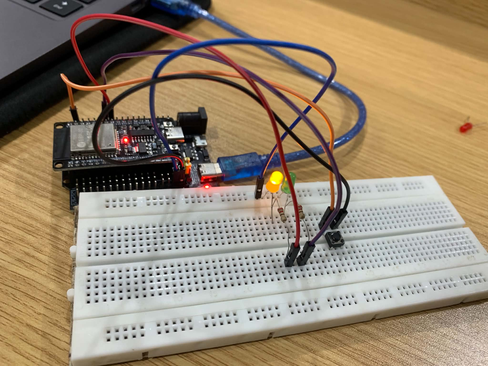
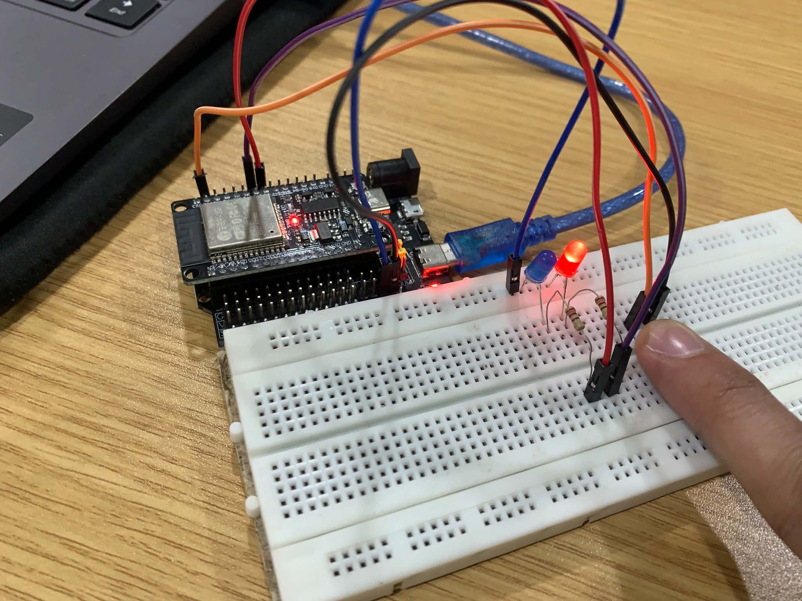
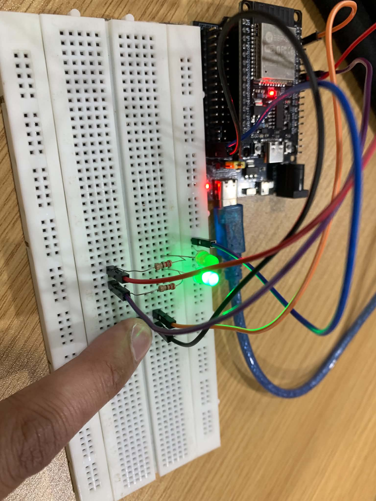

# Laboratory Activity 3: GPIO and Button Control

## Overview

This laboratory activity demonstrates the use of **GPIO (General Purpose Input/Output)** on an ESP32 microcontroller. A push button is used as a digital input to control two LEDs as digital outputs.

The button uses the ESP32's internal pull-up resistor through `INPUT_PULLUP`. When the button is pressed, the two LEDs change their states using an `if/else` condition.

## Features

* Uses ESP32 GPIO pins for digital input and output
* Uses the internal pull-up resistor on GPIO 23
* LED 1 turns **ON** when the button is released
* LED 2 turns **ON** when the button is pressed
* Uses an `if/else` statement for button control
* Demonstrates basic digital GPIO operation

## Components

* ESP32 development board
* Tactile push button
* 2 × LEDs
* 2 × 100Ω resistors
* Breadboard
* Jumper wires
* USB cable

## Wiring

### Push Button

* Button terminal 1 → ESP32 GPIO 23
* Button terminal 2 → GND

### LED 1

* Anode → GPIO 18 through a 100Ω resistor
* Cathode → GND

### LED 2

* Anode → GPIO 19 through a 100Ω resistor
* Cathode → GND

## Circuit Diagram



## Project Setup





## Source Code

```cpp
#include <Arduino.h>

const uint8_t BUTTON_PIN = 23;
const uint8_t LED1_PIN = 18;
const uint8_t LED2_PIN = 19;

void setup() {
  pinMode(BUTTON_PIN, INPUT_PULLUP);
  pinMode(LED1_PIN, OUTPUT);
  pinMode(LED2_PIN, OUTPUT);

  digitalWrite(LED1_PIN, HIGH);
  digitalWrite(LED2_PIN, LOW);
}

void loop() {
  int buttonState = digitalRead(BUTTON_PIN);

  if (buttonState == LOW) {
    digitalWrite(LED1_PIN, LOW);
    digitalWrite(LED2_PIN, HIGH);
  } else {
    digitalWrite(LED1_PIN, HIGH);
    digitalWrite(LED2_PIN, LOW);
  }
}
```

## Observation

When the button is **released**:

* Button state = `HIGH`
* LED 1 = **ON**
* LED 2 = **OFF**

When the button is **pressed**:

* Button state = `LOW`
* LED 1 = **OFF**
* LED 2 = **ON**

## How to Run

1. Connect the ESP32 and all components according to the wiring instructions.
2. Connect the ESP32 to the computer using a USB cable.
3. Open the project in **PlatformIO** or Arduino IDE.
4. Select the correct ESP32 board and COM port.
5. Upload the program to the ESP32.
6. Restart the board if necessary.
7. Press and release the button to observe the LEDs changing states.

## Expected Output

| Button State | GPIO 23 | LED 1 | LED 2 |
| ------------ | ------- | ----- | ----- |
| Released     | HIGH    | ON    | OFF   |
| Pressed      | LOW     | OFF   | ON    |

## Documentation Video

The project documentation video is included in this repository as:

**`documentation.mp4`**

The video demonstrates the actual operation of the ESP32 GPIO and button-controlled LED circuit.

## Conclusion

This laboratory activity demonstrates the basic operation of digital GPIO on the ESP32. The push button is configured as a digital input using the internal pull-up resistor, while two LEDs are configured as digital outputs. The `if/else` statement determines the LED states based on the button's input.

Through this activity, the use of **digital input, digital output, GPIO pins, internal pull-up resistors, and conditional statements** was demonstrated.

## Disclaimer

This project is intended for educational and laboratory documentation purposes. The images included in this README represent the actual project setup.
